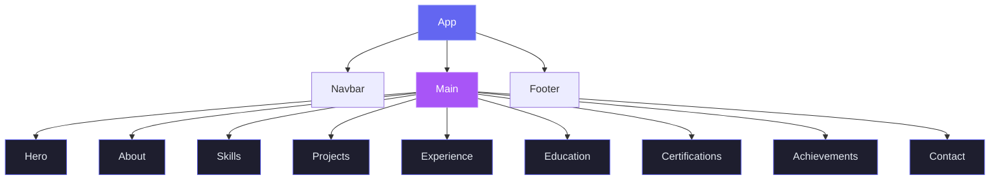
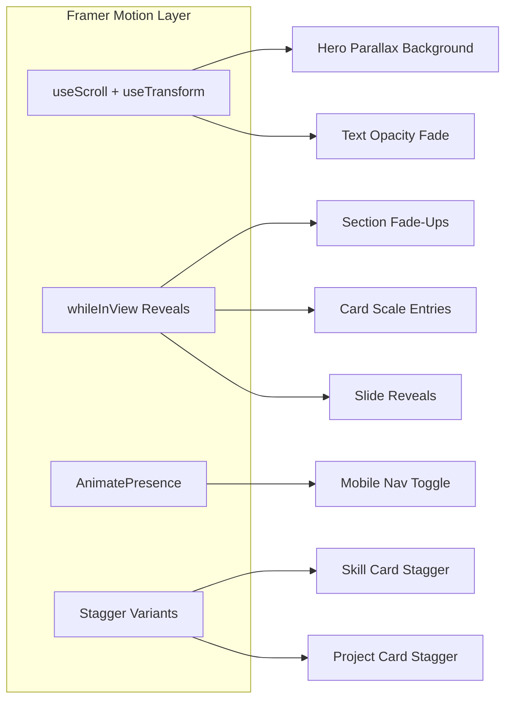
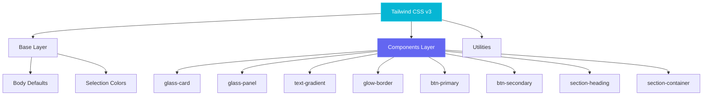

# Architecture Overview

This document describes the component hierarchy and data flow of the Personal Portfolio Website.

## Component Tree

## Animation Layer Architecture

## Styling Architecture

