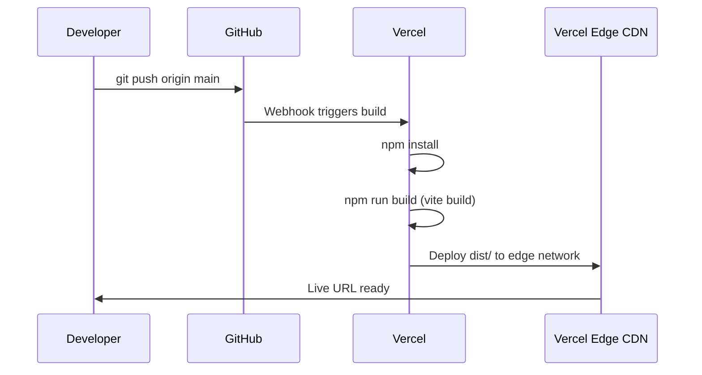

# Deployment Guide

This portfolio is configured for seamless deployment on Vercel.

## Deployment Flow

## Steps to Deploy

1. Create a free account at [vercel.com](https://vercel.com)
2. Click "Add New Project" and import your GitHub repository
3. Vercel auto-detects the Vite framework preset
4. Build settings are automatically configured:
   - Build Command: `npm run build`
   - Output Directory: `dist`
   - Install Command: `npm install`
5. Click "Deploy" and wait for the build to complete
6. Your site is live at `https://your-project.vercel.app`

## Continuous Deployment

Every push to the `main` branch triggers an automatic redeployment. Preview deployments are created for pull requests.

## Environment Variables

This project does not require any environment variables for deployment.

## Post-Deployment Verification

After deployment, verify the following:

- All sections load correctly
- Navigation links scroll to the right sections
- Images and avatar load properly
- Animations play smoothly
- Mobile responsive layout works on real devices
- No console errors in browser dev tools
- Lighthouse audit meets minimum scores
