# Folder Structure

```mermaid
graph TD
    ROOT["Personal-Portfolio-Website/"] --> PUB["public/"]
    ROOT --> SRC["src/"]
    ROOT --> DOCS["docs/"]
    ROOT --> CFG["Config Files"]

    PUB --> FAV["favicon.svg"]
    PUB --> ICO["icons.svg"]
    PUB --> AVT["avatar.png"]

    SRC --> MAIN["main.jsx"]
    SRC --> APP["App.jsx"]
    SRC --> CSS["index.css"]
    SRC --> COMP["components/"]

    COMP --> NAV["Navbar.jsx"]
    COMP --> HERO["Hero.jsx"]
    COMP --> ABT["About.jsx"]
    COMP --> SKL["Skills.jsx"]
    COMP --> PRJ["Projects.jsx"]
    COMP --> EXP["Experience.jsx"]
    COMP --> EDU["Education.jsx"]
    COMP --> CRT["Certifications.jsx"]
    COMP --> ACH["Achievements.jsx"]
    COMP --> CON["Contact.jsx"]
    COMP --> FTR["Footer.jsx"]

    DOCS --> PO["PROJECT_OVERVIEW.md"]
    DOCS --> AR["ARCHITECTURE.md"]
    DOCS --> WF["WORKFLOW.md"]
    DOCS --> FS["FOLDER_STRUCTURE.md"]
    DOCS --> DP["DEPLOYMENT.md"]

    CFG --> TC["tailwind.config.js"]
    CFG --> VC["vite.config.js"]
    CFG --> PC["postcss.config.js"]
    CFG --> PK["package.json"]

    style ROOT fill:#6366f1,stroke:#818cf8,color:#fff
    style SRC fill:#a855f7,stroke:#c084fc,color:#fff
    style COMP fill:#ec4899,stroke:#f472b6,color:#fff
```

## File Descriptions

| File | Purpose |
|------|---------|
| `main.jsx` | Application entry point rendering App into the DOM |
| `App.jsx` | Root component composing all sections in order |
| `index.css` | Global styles, Tailwind directives, design system utilities |
| `Navbar.jsx` | Fixed navigation with scroll detection and mobile drawer |
| `Hero.jsx` | Full-screen landing with parallax and particle effects |
| `About.jsx` | Personal bio with avatar and focus area cards |
| `Skills.jsx` | Technology grid with brand-color hover interactions |
| `Projects.jsx` | Featured project cards with staggered entry |
| `Experience.jsx` | Timeline-based professional experience |
| `Education.jsx` | Academic background cards |
| `Certifications.jsx` | Certification badges |
| `Achievements.jsx` | Awards and honors |
| `Contact.jsx` | Contact form and social links |
| `Footer.jsx` | Copyright and social icons |
