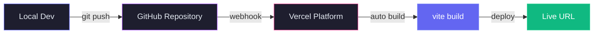
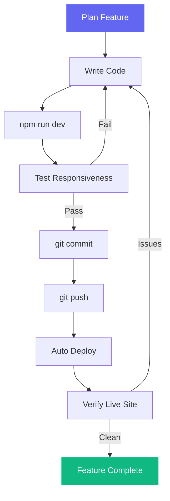

# Development Workflow

This document outlines the development lifecycle and workflow for the Personal Portfolio Website.

## Build & Deploy Pipeline

## Development Cycle

## Quality Checklist

Each feature goes through this verification process before merging:

1. Visual check on mobile (375px), tablet (768px), and desktop (1280px)
2. No horizontal overflow or broken layouts
3. Animations trigger correctly on scroll
4. All links are functional and open correctly
5. Lighthouse audit maintains target scores
6. Code is clean with no unused imports or variables
